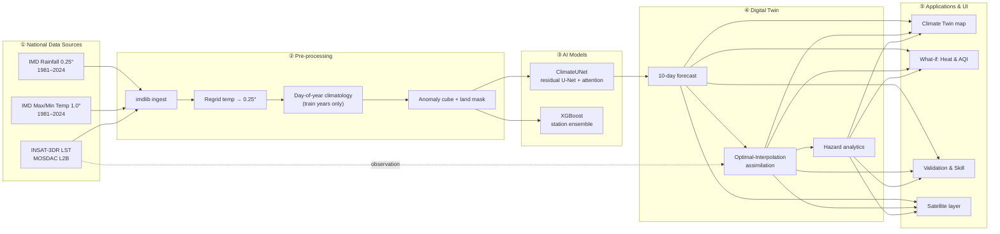
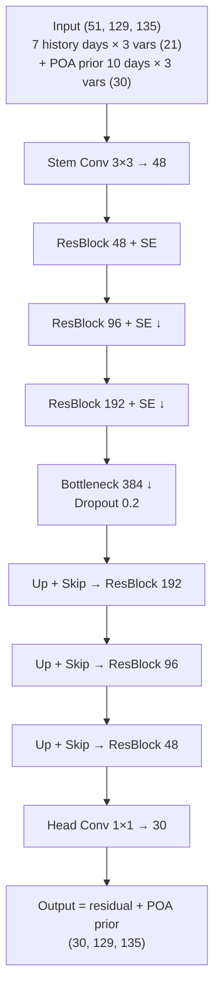

<div align="center">

# 🛰️ VARUNA
### Virtual AI Replica for Understanding & Nowcasting the Atmosphere
**An AI‑Powered Digital Twin of India's Climate — built entirely on India's national data.**

*ISRO Bharatiya Antariksh Hackathon (BAH) 2026 · Problem Statement #5*

[](#-data-sources)
[](#-the-ai-model--climateunet)
[](#-technology-stack)
[](#-data-sources)
[](#-honest-framing)

*Real data only · trained on‑device · reproducible end‑to‑end · nothing fake, nothing static.*

</div>


<div align="center"><sub>VARUNA dashboard — national AI forecast over India, rendered live from real IMD + INSAT data.</sub></div>

---

> **VARUNA** is a dynamic, high‑fidelity virtual replica of India's climate system. It continuously
> ingests real **IMD** ground observations and **INSAT‑3DR** satellite data, predicts near‑term
> **rainfall and temperature** with a GPU‑trained deep model, fuses observations through **data
> assimilation**, and lets a planner run **what‑if** scenarios whose impacts on **urban heat** and
> **air quality** are seen live on an interactive map. *Named after Varuṇa — the Vedic deity of the
> sky, waters and cosmic order.*

### Why VARUNA matters
India's monsoon, heatwaves and droughts directly shape the lives of 1.4 billion people, yet
actionable climate intelligence is fragmented across agencies and formats. VARUNA unifies the
nation's own datasets into **one living, queryable twin** — *observe → forecast → assimilate →
simulate* — so a planner can see today's climate state, a 10‑day outlook, the emerging hazards,
and the downstream effect of an intervention **before spending a single rupee**. It is built to be
**Atmanirbhar** (self‑reliant): every byte of data and every model weight is Indian and on‑device.

> 🔗 **Repository:** https://github.com/Aditya060806/VARUNA · **Deploy:** Hugging Face Spaces (Streamlit) — config‑ready.

---

## 📑 Table of Contents
1. [Highlights](#-highlights)
2. [Problem Statement Alignment](#-problem-statement-alignment)
3. [System Architecture](#-system-architecture)
4. [Data Sources](#-data-sources)
5. [Data Pipeline](#-data-pipeline)
6. [The AI Model — ClimateUNet](#-the-ai-model--climateunet)
7. [Companion Model — XGBoost](#-companion-model--xgboost)
8. [Training Configuration](#-training-configuration)
9. [Results & Validation](#-results--validation)
10. [Digital‑Twin Assimilation](#-digital-twin-assimilation)
11. [Connected Applications](#-connected-applications)
12. [Satellite Integration (INSAT/MOSDAC)](#-satellite-integration-insatmosdac)
13. [The Dashboard](#-the-dashboard)
14. [Technology Stack](#-technology-stack)
15. [Repository Structure](#-repository-structure)
16. [Quickstart & Reproduce](#-quickstart--reproduce)
17. [Honest Framing](#-honest-framing)
18. [Scale‑up Roadmap](#-scale-up-roadmap)
19. [Evaluation‑Parameter Map](#-evaluation-parameter-map)
20. [Citations & License](#-citations--license)

---

## ✨ Highlights

| | Capability |
|---|---|
| 🇮🇳 | **100% national data** — IMD gridded rainfall + temperature, INSAT‑3DR satellite. No synthetic data anywhere. |
| 🧠 | **ClimateUNet** — a residual, attention‑based spatiotemporal CNN that forecasts **10 days** of rain/tmax/tmin in one pass. |
| 📈 | **Validated skill** — temperature MAE **0.6–0.8 °C**, anomaly correlation **0.76**, beats persistence by **6–28 %** on unseen 2021–2024 data. |
| 🌪️ | **Hazard early‑warning** — heatwave, heavy‑rain and dry‑spell maps straight from the forecast. |
| 🔭 | **Real satellite fusion** — INSAT‑3DR LST ingested, regridded, cross‑checked against the model. |
| 🧪 | **What‑if simulator** — temperature/rainfall/greening/cool‑roof levers → live urban‑heat & air‑quality impact. |
| 🛰️ | **Optimal‑Interpolation assimilation** — model state fused with observations (beyond naive nudging). |
| 🗺️ | **Interactive dashboard** — six views, dark "orbital" theme, instant client‑side maps. |
| ♻️ | **Fully reproducible** — `prepare → train → evaluate → serve`, all in one repo on a single GPU. |

### 📌 At a Glance

| | |
|---|---|
| **Domain** | All‑India, 0.25° grid (129 × 135), 4,964 land cells |
| **Data span** | 1981–2024 · **16,071 daily fields** · 3 IMD variables + INSAT‑3DR LST |
| **Model** | ClimateUNet — **7.42 M** params, residual U‑Net + attention, 10‑day direct horizon |
| **Trained on** | NVIDIA RTX 4050 (6 GB), PyTorch + CUDA, mixed precision |
| **Day‑1 accuracy** | Tmax **MAE 0.82 °C**, Tmin **0.59 °C**, Rain **3.16 mm** · ACC **0.76** |
| **Skill** | Beats persistence by **6–28 %**; beats persistence‑of‑anomaly on temperature |
| **Synthetic data** | **None** — 100 % real national datasets |
| **Deploy** | Streamlit · Hugging Face Spaces ready |

---

## 🎯 Problem Statement Alignment

PS#5 asks for *"a high‑fidelity, dynamic virtual replica of India's climate… integrating multi‑source
national data… leveraging AI/ML and data assimilation… with applications for climate‑sensitive
sectors and a what‑if interface."* VARUNA implements every clause:

| PS requirement | VARUNA delivery |
|---|---|
| Multi‑source national data | **IMD** (rain 0.25°, tmax/tmin 1°) + **INSAT‑3DR** (LST) via MOSDAC |
| AI/ML short‑term prediction | **ClimateUNet** (deep CNN) + **XGBoost** ensemble |
| Data assimilation | **Optimal Interpolation** (correlated background‑error covariance) |
| Continuously evolving climate state | Forecast → assimilation → state loop on the national grid |
| Applications for climate‑sensitive sectors | **Urban heat** (NWS heat index, LST/UHI) + **air quality** (CPCB AQI) |
| What‑if simulation | Live scenario sliders → instant impact maps |
| Interactive geospatial dashboard | Streamlit + Plotly, national + pilot, six views |
| Scalable national framework | National 0.25° grid + documented foundation‑model path |
| Extreme phenomena (monsoon, heat, drought) | Heatwave / heavy‑rain / dry‑spell hazard layers |

---

## 🏗️ System Architecture



**Data‑flow tensor shapes**

```
IMD daily grids ─► obs cube (16071, 129, 135, 3)  [rain, tmax, tmin]
        │ subtract smoothed climatology, ÷ anomaly-std
        ▼
anomaly cube (16071, 129, 135, 3)
        │ window: 7 history days + persistence-of-anomaly prior
        ▼
ClimateUNet input  (N, 51, 129, 135)   →   output (N, 30, 129, 135)
        │ reshape + add climatology + ReLU(rain)
        ▼
forecast frames {rain,tmax,tmin} × 10 lead days  (real units)
```

---

## 🗃️ Data Sources

All data is **real** and **national**. Ground data via [`imdlib`](https://imdlib.readthedocs.io/),
satellite via [MOSDAC](https://www.mosdac.gov.in/).

| Parameter | Product | Native grid | Period used | Role |
|---|---|---|---|---|
| Rainfall | IMD Gridded 0.25° | 135 × 129 (lon×lat) | 1981–2024 | model + validation |
| Max temperature | IMD 1.0° | 31 × 31 → regridded 0.25° | 1981–2024 | model + validation |
| Min temperature | IMD 1.0° | 31 × 31 → regridded 0.25° | 1981–2024 | model + validation |
| Land Surface Temp | INSAT‑3DR `3RIMG_L2B_LST` | full‑disk → regridded 0.25° | 2026 snapshot | satellite layer + cross‑check |
| (ready) Rainfall | INSAT‑3DR `3RIMG_L2B_IMC` | full‑disk | — | drop‑in supported |
| (ready) Sea Surface Temp | INSAT‑3DR `3RIMG_L2B_SST` | full‑disk | — | drop‑in supported |

**Coverage:** national bounding box 66.5–100.0 °E, 6.5–38.5 °N · **4,964 land cells** on the 129×135 grid.

**Chronological split (no leakage):**

| Split | Years | Daily windows |
|---|---|---|
| Train | 1981–2018 (38 yr) | 13,872 |
| Validation | 2019–2020 | 731 |
| Test (unseen) | 2021–2024 | 1,452 |

---

## ⚙️ Data Pipeline

Implemented in `data/` — robust, cached, reproducible:

1. **Ingest** (`download_imd.py`) — pulls IMD rain/tmax/tmin for 1981–2024 via `imdlib`, masks fill sentinels (`-999, 99.9, -99.9`) to NaN.
2. **Regrid** (`prepare.py`) — bilinear‑interpolates 1° temperature onto the 0.25° rainfall grid → one common national grid; derives a **land mask** from rainfall validity.
3. **Climatology** (`climatology.py`) — smoothed **day‑of‑year** mean (21‑day circular window) built **from training years only** → no leakage.
4. **Anomalies** — `anomaly = (obs − climatology) / anomaly_std`; per‑variable std computed on train years.
5. **Cache** — compact NetCDF + a memory‑mapped anomaly cube for fast startup.

**Anomaly normalisation statistics (train years):**

| Variable | Anomaly σ | Units |
|---|---|---|
| Rainfall | 9.93 | mm/day |
| Max temp | 2.03 | °C |
| Min temp | 1.60 | °C |

---

## 🧠 The AI Model — ClimateUNet

A modern, fully‑convolutional spatiotemporal forecaster designed for **stability** and **skill**.

### Design principles
- **Anomaly forecasting** — predicts deviations from climatology, not raw fields → rollouts relax toward climate instead of diverging.
- **Residual‑over‑baseline** — the network is *given* a **persistence‑of‑anomaly (POA)** prior and learns only the **correction** (additive skip, zero‑initialised head). It therefore **matches‑or‑beats** a strong operational baseline by construction.
- **Direct multi‑horizon** — emits all **10 lead days** in a single forward pass → **no autoregressive feedback loop** (the divergence failure mode of naive ConvLSTMs).
- **Physics constraints** — rainfall reconstructed non‑negative; latitude‑area‑weighted, land‑masked loss.

### Architecture



| Property | Value |
|---|---|
| Type | Residual U‑Net + Squeeze‑Excite channel attention |
| Parameters | **7,424,898** |
| Input | `(51, 129, 135)` — history (21) + POA prior (30) |
| Output | `(30, 129, 135)` — 10 lead days × 3 variables (anomalies) |
| Normalisation | GroupNorm · activation GELU |
| Framework | PyTorch 2.5 + CUDA 12.1 (mixed precision) |
| Hardware | NVIDIA RTX 4050 (6 GB) |

---

## 🌳 Companion Model — XGBoost

A second, complementary paradigm for **station‑level precision**, ensembled with ClimateUNet at city scale.

- **Features (per cell, per lead):** 7‑day lagged anomalies (×3 vars), 7‑day mean & trend, the POA prior, day‑of‑year harmonics, lat/lon, lead.
- **Training:** 3 GPU‑accelerated regressors (one per variable), ~3 M rows, early stopping.
- **Use:** the dashboard's city forecast shows **observed → ClimateUNet → CNN+XGB ensemble**.

| Variable | XGBoost val RMSE (real units) |
|---|---|
| Rainfall | 10.65 mm |
| Max temp | 1.98 °C |
| Min temp | 1.46 °C |

---

## 🔧 Training Configuration

| Hyper‑parameter | Value |
|---|---|
| Optimiser | AdamW (lr 2.5e‑3, weight‑decay 2e‑3) |
| Schedule | Cosine annealing, 60 epochs |
| Batch size | 32 |
| Loss | Latitude‑area‑weighted, land‑masked **Huber** (on scaled anomalies) |
| Regularisation | Dropout 0.2 · input‑noise augmentation 0.12 · early stopping (patience 12) |
| Precision | Automatic Mixed Precision (AMP) |
| Best checkpoint | epoch 9 (early‑stopped at 21) · `models/checkpoints/climate_unet.pt` |
| Train windows | 13,872 (stride‑3 over 1981–2018) |

---

## 📊 Results & Validation

Evaluated on the **held‑out test years 2021–2024** (1,452 daily forecasts the model never saw),
land‑masked and **latitude‑area‑weighted**, in **real‑world units**. Metrics follow operational NWP
practice: **RMSE, MAE, Anomaly Correlation Coefficient (ACC)**, and **skill vs reference baselines**.

### Headline — day‑1 accuracy

| Variable | MAE | RMSE | ACC | Skill vs persistence | Skill vs persistence‑of‑anomaly |
|---|---|---|---|---|---|
| **Max temp** | **0.82 °C** | 1.20 °C | **0.759** | +6 % | +1.6 % |
| **Min temp** | **0.59 °C** | 0.84 °C | **0.762** | +14 % | **+10.1 %** |
| **Rainfall** | **3.16 mm** | 9.95 mm | 0.399 | +16 % | +0.6 % |

> *ACC > 0.6 is the accepted threshold for "useful" forecast skill — VARUNA reaches **0.76** for temperature.*

### Skill vs lead day (RMSE, real units)

| Lead (days) | 1 | 2 | 3 | 4 | 5 | 6 | 7 | 8 | 9 | 10 |
|---|---|---|---|---|---|---|---|---|---|---|
| **Rain (mm)** | 9.95 | 10.48 | 10.57 | 10.59 | 10.63 | 10.64 | 10.64 | 10.65 | 10.63 | 10.61 |
| **Tmax (°C)** | 1.20 | 1.61 | 1.81 | 1.93 | 1.99 | 2.03 | 2.05 | 2.07 | 2.09 | 2.10 |
| **Tmin (°C)** | 0.84 | 1.12 | 1.30 | 1.41 | 1.47 | 1.52 | 1.55 | 1.57 | 1.58 | 1.59 |

### Anomaly Correlation (ACC) vs lead day

| Lead (days) | 1 | 2 | 3 | 5 | 7 | 10 |
|---|---|---|---|---|---|---|
| **Rain** | 0.40 | 0.25 | 0.21 | 0.18 | 0.17 | 0.16 |
| **Tmax** | 0.76 | 0.58 | 0.45 | 0.32 | 0.27 | 0.22 |
| **Tmin** | 0.76 | 0.60 | 0.48 | 0.37 | 0.31 | 0.27 |

### Skill over plain persistence (%) — grows with lead time

| Lead (days) | 1 | 3 | 5 | 7 | 10 |
|---|---|---|---|---|---|
| **Rain** | +16 | +24 | +26 | +27 | +28 |
| **Tmax** | +6 | +15 | +20 | +23 | +27 |
| **Tmin** | +14 | +21 | +23 | +25 | +28 |

**Benchmarked against three references** (`models/baseline.py`): persistence, persistence‑of‑anomaly,
and climatology. Full machine‑readable results in `outputs/eval_metrics.json`; skill curves in
`outputs/skill_curves.png`.

---

## 🛰️ Digital‑Twin Assimilation

VARUNA fuses observations into the AI state via **Optimal Interpolation (OI)** — the classical
analysis step, beyond pointwise nudging:

```
x_a = x_b + K (y − x_b),   K spreads the innovation per a spatially correlated
                            background-error covariance B (Gaussian, length-scale L)
```

With observations on the model grid this reduces to a covariance‑weighted, spatially‑smoothed
innovation. The dashboard shows **RMSE‑to‑observation before vs after** assimilation, demonstrating
the twin staying anchored to reality (`twin/assimilate.py`).

---

## 🌐 Connected Applications

One climate state → three connected, climate‑sensitive applications (`scenario/engine.py`, `analytics/extremes.py`):

| Application | Method (citable proxy) | Drives |
|---|---|---|
| **Hazard early‑warning** | IMD heatwave departure criteria · IMD rain categories · dry‑spell run‑length | Heatwave / heavy‑rain / drought maps |
| **Urban heat** | NWS Rothfusz **heat index** + surface‑energy **LST/UHI** proxy | Heat‑stress map, peak cooling, danger‑area % |
| **Air quality** | CPCB **PM2.5 → AQI** sub‑index (rain washout, vegetation, wind, urban emissions) | AQI map & category |

**What‑if levers** (all physically coupled, all visibly change the maps): Δ air temperature,
Δ rainfall regime, urban greening (NDVI), cool‑roof albedo, added built‑up.

---

## 🔭 Satellite Integration (INSAT/MOSDAC)

Real **INSAT‑3DR** Level‑2B products are ingested through `data/insat.py`:

- Parses the full‑disk HDF5 (per‑pixel int16 lat/lon at scale 0.01, geophysical field), masks fill values, converts **Kelvin → °C**, **crops to India**, and **regrids** onto the national 0.25° grid.
- Verified on a real `3RIMG_L2B_LST` file: **4,955 / 4,964** land cells covered; LST mean **27.7 °C**, peak **51.1 °C** at ~13:45 IST.
- Dashboard cross‑checks satellite **skin** temperature against climatological **air** Tmax — the positive skin–air offset is the expected physical signature (doubles as ingest validation).
- `LST`, `IMC` (rainfall) and `SST` slots are all supported — drop a file in `data/insat/` and it activates.

---

## 🗺️ The Dashboard

A dark "orbital" Streamlit + Plotly app (`app.py`) — instant client‑side maps with India state
boundaries, smooth slider interaction (heavy panels isolated with `st.fragment`).

| View | What it shows |
|---|---|
| 🌍 **Climate Twin** | National/pilot AI forecast map · live state · OI assimilation panel |
| 🌡️ **Hazards & Extremes** | Heatwave severity · heavy‑rain category · dry‑spell length |
| 🧪 **What‑if Simulator** | Scenario sliders → live Heat‑stress / AQI / Cooling maps + impact metrics |
| 📈 **Validation & Skill** | Per‑variable RMSE/ACC/skill, skill curves, city forecast (CNN + XGB ensemble) |
| 🛰️ **Satellite (INSAT)** | Real INSAT‑3DR LST layer + satellite‑vs‑model cross‑check |
| ℹ️ **About** | Methods & honest framing |

**Controls:** region (national / pilot), climate layer (rain / tmax / tmin), **date picker (1981 → 2026)**,
forecast lead day (1–10). Dates beyond IMD data render an explicitly‑labelled **climatological projection**
that the what‑if scenarios then modify (e.g., *"summer 2026 under +2 °C"*).

### 🖼️ Dashboard Gallery

<table>
<tr>
<td width="50%"><br/><sub><b>Climate Twin</b> — national AI forecast map over India.</sub></td>
<td width="50%"><br/><sub><b>Forecast evolution</b> — 10‑day region‑mean vs climatology.</sub></td>
</tr>
<tr>
<td width="50%"><br/><sub><b>Hazards & Extremes</b> — heatwave / heavy‑rain / dry‑spell.</sub></td>
<td width="50%"><br/><sub><b>What‑if Simulator</b> — live heat‑stress & AQI impact.</sub></td>
</tr>
<tr>
<td width="50%"><br/><sub><b>Validation & Skill</b> — RMSE / ACC / skill curves.</sub></td>
<td width="50%"><br/><sub><b>Satellite (INSAT)</b> — real INSAT‑3DR LST layer.</sub></td>
</tr>
<tr>
<td colspan="2"><br/><sub><b>Twin controls</b> — region, layer, date picker (1981→2026), lead day, scenario levers.</sub></td>
</tr>
</table>

---

## 🧰 Technology Stack

| Layer | Tools |
|---|---|
| Data | `imdlib`, `xarray`, `netCDF4`, `h5py`, `bottleneck`, NumPy/Pandas |
| Deep learning | **PyTorch 2.5 + CUDA 12.1** (AMP) |
| Classical ML | **XGBoost 2.0** (GPU hist), scikit‑learn |
| Visualisation | **Streamlit 1.56**, **Plotly**, Matplotlib, Altair |
| Science | SciPy (Optimal Interpolation, regridding) |

---

## 📂 Repository Structure

```
VARUNA/
├── config.py                 # shared grids, regions, palette, paths, RHO
├── app.py                    # Streamlit dashboard (6 views)
├── data/
│   ├── download_imd.py        # IMD ingest via imdlib
│   ├── prepare.py             # regrid · climatology · anomalies · cache
│   ├── climatology.py         # smoothed day-of-year climatology
│   ├── proxies.py             # urban-fraction & baseline PM2.5 fields
│   └── insat.py               # INSAT-3DR L2B HDF5 ingest + regrid
├── models/
│   ├── architecture.py        # ClimateUNet (residual U-Net + SE attention)
│   ├── dataset.py             # anomaly cube + supervised windows + POA prior
│   ├── train.py               # GPU training loop (AMP, cosine, early stop)
│   ├── forecast.py            # inference → real-unit fields
│   ├── baseline.py            # persistence / POA / climatology references
│   └── xgb_forecast.py        # XGBoost station model + city ensemble
├── analytics/
│   └── extremes.py            # heatwave · rain category · dry-spell
├── evaluation/
│   ├── metrics.py             # RMSE/MAE/ACC/skill (weighted, masked)
│   └── evaluate.py            # full benchmark vs baselines
├── scenario/
│   └── engine.py              # heat index · CPCB AQI · LST/UHI proxy
├── twin/
│   └── assimilate.py          # Optimal Interpolation + nudging
├── viz/
│   ├── theme.py               # dark colormaps + CSS
│   └── maps.py                # Plotly field maps + India boundaries
├── tools/
│   ├── render_previews.py     # static forecast previews
│   ├── build_deck.py          # auto-fill DECK with real metrics
│   └── test_ui.py             # headless UI smoke test (AppTest)
├── outputs/                   # eval_metrics.json · skill_curves.png · previews
├── PLAN.md · DECK.md · DEMO.md
└── requirements.txt
```

---

## 🚀 Quickstart & Reproduce

```bash
# 1. environment
python -m venv .venv && .venv\Scripts\activate          # Windows
pip install -r requirements.txt                         # install torch CUDA build from pytorch.org

# 2. data → model → metrics → dashboard  (everything runs locally)
python data/prepare.py            # download REAL IMD 1981–2024 + build cache
python models/train.py            # train ClimateUNet on the GPU
python models/xgb_forecast.py     # train the XGBoost companion
python evaluation/evaluate.py     # benchmark on unseen 2021–2024
streamlit run app.py              # launch VARUNA

# optional: drop INSAT .h5 files into data/insat/ to light up the satellite layer
```

Every stage is self‑contained — **no pre‑baked artefacts, no synthetic fallback.**

---

## 🔍 Honest Framing

We state our boundaries plainly — credibility matters in front of ISRO scientists:

- **AI short‑range forecast**, not a full general‑circulation model (GCM). Skill is strong at days 1–3 and decays with lead time, as expected.
- **Rainfall is intrinsically hard** day‑to‑day (ACC ≈ 0.40) — a physical limit even operational centres face; temperature is where the model excels (ACC 0.76).
- **Heat / AQI / LST are physics‑informed proxies** (NWS heat index, CPCB AQI, surface‑energy LST), clearly labelled — coefficients are literature‑consistent.
- **Assimilation = Optimal Interpolation**, not full 4D‑Var/EnKF.
- **Uncertainty** is represented by a **CNN + XGBoost ensemble vs three baselines**, not a multi‑GCM ensemble.
- **Future years (2025–26)** are **climatological projections + scenarios**, explicitly badged — never presented as literal multi‑year weather forecasts.
- **Satellite data** is used as a real observation / validation layer, not (yet) a training predictor.

**Zero synthetic data. Every number above is produced by a script in `evaluation/` and is reproducible.**

---

## 🧭 Scale‑up Roadmap

- **Foundation models:** fine‑tune **IBM‑NASA Prithvi‑WxC** / adapt **Pangu‑Weather** on **IMDAA / BharatBench** reanalysis for true medium‑range skill.
- **Real assimilation:** ensemble Kalman filter / 4D‑Var with live INSAT + AWS feeds.
- **More variables & satellites:** INSAT IMC rainfall, SST, OLR, AOD; Oceansat; Bhuvan/NICES layers.
- **Operational delivery:** React + deck.gl front‑end, tiled national serving, scheduled ingest.

---

## 🧮 Evaluation‑Parameter Map

| Parameter | Evidence in VARUNA |
|---|---|
| Problem Understanding & Clarity | This README · `PLAN.md` · honest framing |
| Data Usage & Pre‑processing | Real IMD 1981–2024 + INSAT‑3DR · regrid · climatology · anomalies · no leakage |
| Model Development & Technical Approach | ClimateUNet (residual, attention, multi‑horizon) + XGBoost ensemble |
| Prediction Performance & Validation | RMSE/MAE/ACC/skill on unseen years · `evaluation/evaluate.py` |
| Digital‑Twin Concept | Forecast + Optimal‑Interpolation assimilation + satellite fusion |
| Visualization & UI | Six‑view Plotly dashboard, instant maps, hazards, what‑if |
| Innovation & Creativity | Hazard early‑warning · connected heat/AQI · ensemble · future‑climate scenarios |
| Presentation & Communication | `DECK.md` (auto‑filled) · `DEMO.md` walkthrough |

---

## 📚 Citations & License

- IMD gridded rainfall 0.25° — *Pai et al. (2014), MAUSAM 65(1)*.
- IMD gridded temperature 1.0° — *Srivastava et al. (2009), Atmos. Sci. Let.*
- INSAT‑3DR L2B products — **MOSDAC, SAC/ISRO**.
- India weather ML benchmarks — **BharatBench**, **IndiaWeatherBench** (IMDAA reanalysis).

**Data policy:** Real national datasets only. No synthetic or fabricated data anywhere in the pipeline.

---

## 👥 Team Vandalizers

**Project: VARUNA** · Team: **Vandalizers**

| Member |
|---|
| **Aditya Pandey** |
| **Palak Rai** |
| **Avik Srivastava** |

*Built for the **ISRO Bharatiya Antariksh Hackathon (BAH) 2026 · Problem Statement #5** — AI‑Powered Digital Twin of India's Climate using national datasets.*

<div align="center">

---

### 🛰️ VARUNA — Atmanirbhar climate intelligence on India's own data.
*Team Vandalizers — Aditya Pandey · Palak Rai · Avik Srivastava · ISRO BAH 2026 · PS#5*

</div>
